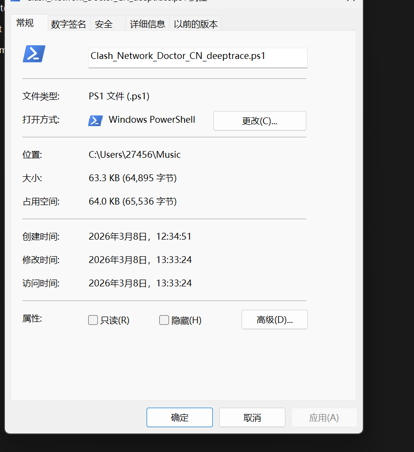
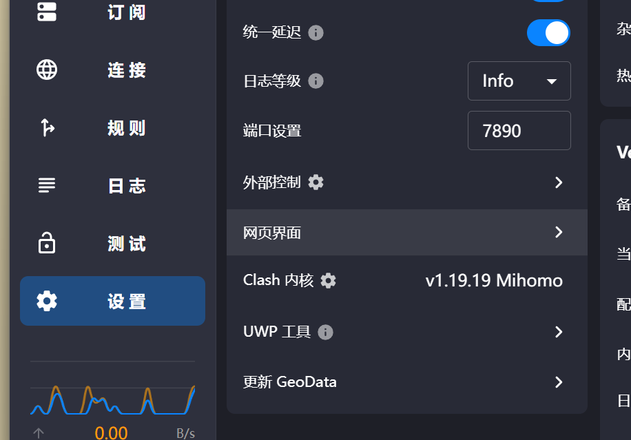
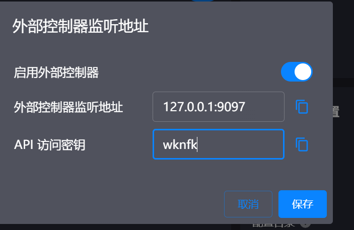
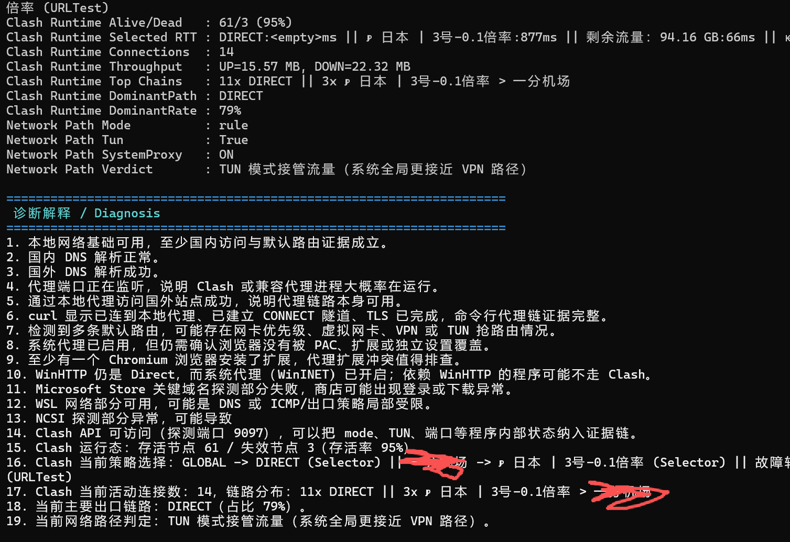

1.鐐瑰嚮鏂囦欢灞炴€э紝鎶妏s1鐨勫父瑙勶紝鍙充笅瑙掔殑鏉ヨ嚜鍒殑鐢佃剳鑴氭湰鍕鹃€夋帀

2.鐐瑰紑clash-verge
鐐瑰嚮璁剧疆銆傜劧鍚庣偣澶栭儴鎺у埗

鐐瑰紑澶栭儴鎺у埗鍣紝璁剧疆瀵嗙爜锛堜负浜嗛槻姝㈡湪椹敾鍑伙紝褰撶劧鎴戝啓鐨勪繚瀛樺瘑閽ユ槸鏄庢枃淇濆瓨锛岄渶瑕佺殑鍙互鍔犲瘑锛夛紝鐐瑰嚮淇濆瓨

3.鐒跺悗鐐瑰嚮cmd閭ｄ釜灏卞彲浠ヨ繍琛屼簡銆傜涓€娆″彲鑳借杈撳叆clash鐨刟pi鐨勫瘑閽?

4. 主要功能（默认全部探测，不需要额外开关）

会打印完整的运行证据、诊断解释和建议动作，重点不是“只看通不通”，而是定位“为什么有的软件能上、有的软件上不了”。

可探测并定位的问题包括：
1) DNS 解析异常（国内/国外/NCSI）
2) Clash 系统代理被覆盖、或仅浏览器走代理
3) WinHTTP / WinINET 分裂（部分程序不走 Clash）
4) WSL 网络问题（含是否安装、是否有发行版、联网模式、WSL 内 DNS/外网）
5) Microsoft Store 无法访问（关键域名 + 服务链）
6) TLS/证书风险（TLS1.2/1.3策略、微软登录站点 HTTPS 探测）
7) Windows 更新依赖服务异常（BITS/wuauserv/CryptSvc/UsoSvc/InstallService）
8) 防火墙/安全软件风险
9) Clash API 运行态深度信息：
   - 当前 mode（rule/global/direct）
   - Tun 是否启用
   - 当前策略组实际选择
   - 节点存活率
   - 活动连接和主出口链路（Dominant Path）

报告里重点看这些字段：
- `Network Path Verdict`：当前到底是 RULE / GLOBAL / DIRECT / TUN 接管
- `Clash Runtime DominantPath`：当前主要出口链路（例如 节点 > 策略组）
- `Clash Runtime DominantRate`：主要链路占比
- `WinHTTP Profile`：WinHTTP 是 Direct 还是代理
- `Microsoft Store` / `Store Probe Evidence`
- `WSL Network` / `NCSI Health` / `TLS/Cert` / `Update Chain`

5. 使用与测试注意

1) 命令行测试时，优先用 `curl` 做 HTTP/HTTPS 级别验证。
2) 不建议用 `ping www.google.com` 代替代理测试：
   - ping 走 ICMP，不代表应用层代理链路可用。
3) 如果某软件只走 WinHTTP，可能出现“浏览器正常、软件不通”：
   - 查看报告里的 `WinHTTP Profile`。
4) 首次需要 Clash API 密钥时会提示输入；成功后会保存，本机后续自动读取。
5) 你改了 API 密钥后，重新运行并输入新密钥即可覆盖旧值。
一个例子如：
